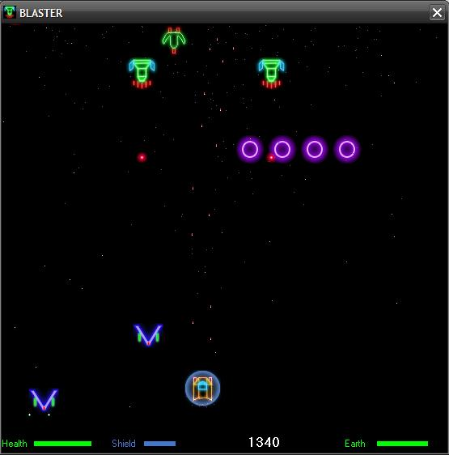



## Blaster: Space Shooter Game

### Description

BLASTER is a pure VB 2D space shooter originally by HLMODER ( http://www.planet-source-code.com/vb/scripts/ShowCode.asp?txtCodeId=72921&lngWId=1 ) I was so impressed by how fast and smooth it ran I decided to take up the project to see what I could with it.

I have made changes to virtually all the code, added many new features and changed some of the graphics. There are several thing I still want to add such as more levels and bosses but the big one is to add sound.
 
### More Info
 

             |
---                |---
**Submitted On**   |2010-12-21 08:41:26
**By**             |[Paul Bahlawan](https://github.com/Planet-Source-Code/PSCIndex/blob/master/ByAuthor/paul-bahlawan.md)
**Level**          |Intermediate
**User Rating**    |5.0 (30 globes from 6 users)
**Compatibility**  |VB 6\.0
**Category**       |[Games](https://github.com/Planet-Source-Code/PSCIndex/blob/master/ByCategory/games__1-38.md)
**World**          |[Visual Basic](https://github.com/Planet-Source-Code/PSCIndex/blob/master/ByWorld/visual-basic.md)
**Archive File**   |[Blaster\_\_S21949112212010\.zip](https://github.com/Planet-Source-Code/paul-bahlawan-blaster-space-shooter-game__1-73636/archive/master.zip)

